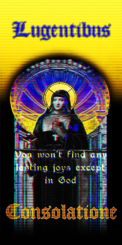

<html lang="en">
<head>
    <meta charset="UTF-8">
    <meta name="viewport" content="width=device-width, initial-scale=1.0">
    <link rel="stylesheet" href="index-style.css">
    <title>landing page for the beatitudes</title>
</head>
<body>
    <header>
        <h1 class="logo">Ginko</h1>
        <ul class="nav">
            <li> <a href="index.html">Home</a> </li>
            <li> <a href="Bart.html">Art</a> </li>
            <li> <a href="history.html">History</a> </li>
        </ul>
    </header>
    <main class="page">
        <ul class="links">
            <li></li>
            <li></li>
        </ul>
        <ul class="sub-title">
            <li><a href="history.html">History</a></li>
            <li><a href="Bart.html"> Art</a></li>
        </ul>
    </main>
</body>
</html>